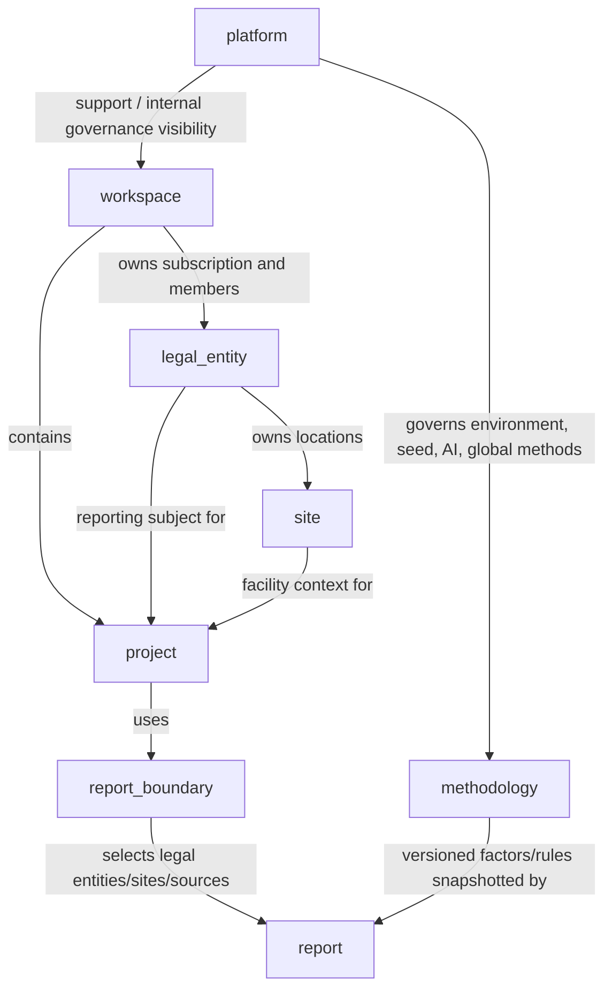

# Navigation Ontology V1

Status: canonical governance/navigation registry. Docs-first only.

This document defines CoCalLab's canonical navigation ontology so product IA, route naming, role policy, and future schema work use one shared vocabulary. It does not authorize a production cutover, table rename, auth rewrite, or RLS rewrite.

## Principles

- `organizations` remains the physical table.
- Current semantic: `organization = workspace`.
- Governance names can be introduced in docs and DTOs before schema cutover.
- Navigation must separate workflow, governance, and platform responsibilities.
- AI governance is platform/internal governance, not a tenant workflow surface.

## Canonical Entities

| Entity | Definition | Ownership | Visibility Scope | Billing Ownership | Audit Responsibility | Report Responsibility |
| --- | --- | --- | --- | --- | --- | --- |
| `workspace` | SaaS tenant, account container, member boundary, subscription unit. | Workspace owner/admin. | Workspace members; platform admins for support/governance. | Owns subscription, billing, feature limits. | Workspace actions, member changes, subscription events. | Hosts projects/reports but is not automatically the reporting subject. |
| `legal_entity` | Registered法人 / tax id / reporting subject under a workspace. | Workspace owner/admin; delegated legal entity governance roles later. | Workspace roles plus entity-scoped roles when introduced. | No direct billing in Phase 1; inherits workspace billing. | Legal identity changes, entity metadata, reporting subject approval. | Primary reporting subject for reports and boundaries. |
| `site` | Facility, installation, office, plant, warehouse, or CBAM-ready location under a legal entity. | Legal entity governance owner or workspace admin. | Workspace/entity/site scoped roles. | No direct billing; inherits workspace. | Site master data, facility/location changes. | Provides facility context and source attribution for project/report boundaries. |
| `project` | Inventory cycle and working unit for documents, activities, calculations, analytics, and report generation. | Workspace/project editors; governed by legal entity/site context. | Project participants and inherited workspace/entity/site roles. | Inherits workspace billing and feature limits. | Project lifecycle, evidence, activity, calculation, and review events. | Generates report versions for a defined reporting period and boundary. |
| `report_boundary` | Governed inclusion/exclusion model for operational control, financial control, or equity share. | Governance roles; workspace admin approval in closed beta. | Project members with appropriate governance/report permissions. | Inherits workspace. | Boundary approvals, methodology, exclusions, selected entity/site/source scope. | Defines what a report is allowed to include; must be snapshotted. |
| `report` | Immutable generated report snapshot and render contract. | Project/report generation roles; auditors can review. | Project members, auditors, permitted viewers. | Inherits workspace/export entitlement. | Report generation, versioning, export, audit review. | Freezes workspace/entity/site/boundary/methodology/factor context at generation time. |
| `methodology` | Accounting standards, factor governance, scope mapping, calculation and adjustment rules. | Methodology governance roles and platform governance. | Governance roles; readonly for tenant users when relevant. | Platform-owned baseline; workspace may own custom factors/rules later. | Factor/rule changes, version approvals, deprecations. | Supplies versioned methods and factors that reports snapshot. |
| `platform` | Internal CoCalLab operations, environment governance, seed governance, AI governance, support controls. | Platform admins only. | Internal users only unless explicitly exposed as readonly diagnostics. | Platform billing operations and plan catalog governance. | Environment, seed, AI, provider, system policy, support access logs. | Does not generate tenant reports; governs infrastructure and system behavior. |

## Entity Relationship Graph

## Layer Classification

### Workflow Layer

Workflow layer entities are used by day-to-day tenant users:

- `project`
- `report`
- documents, drafts, activities, calculations, analytics as project workflow surfaces

Navigation examples:

- `/workspace/:workspaceId/projects`
- `/project/:projectId/documents`
- `/project/:projectId/activities`
- `/project/:projectId/reports`

### Governance Layer

Governance layer entities define accountability and report correctness:

- `workspace`
- `legal_entity`
- `site`
- `report_boundary`
- `methodology`

Navigation examples:

- `/workspace/:workspaceId/settings`
- `/workspace/:workspaceId/legal-entities`
- `/workspace/:workspaceId/sites`
- `/project/:projectId/boundary`
- `/factors/*`
- `/methodology/*`

### Platform Layer

Platform layer entities are internal CoCalLab operations:

- `platform`
- environment governance
- seed governance
- AI governance
- provider governance
- support diagnostics

Navigation examples:

- `/platform/environments`
- `/platform/seed-governance`
- `/platform/ai-governance`
- `/platform/methodology-registry`

## Naming Rules

- Use `workspace` in new IA/docs/DTOs.
- Keep `organization_id` only as a compatibility API/database field until a planned compatibility migration exists.
- Use `legal_entity` only for registered reporting subjects.
- Use `site` only for facility/location/installational context.
- Use `project` only for reporting cycle/workflow unit.
- Use `report_boundary` only for inclusion/exclusion governance.
- Use `platform` only for internal system governance.

## Navigation Anti-Patterns

- Do not place AI governance under tenant workflow navigation.
- Do not place seed governance under workspace settings.
- Do not treat workspace as legal entity in new copy.
- Do not route `/platform/*` through tenant admin layouts.
- Do not expose factor governance as ordinary activity editing.
